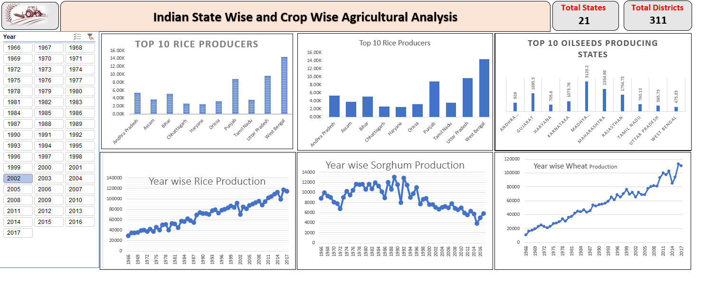
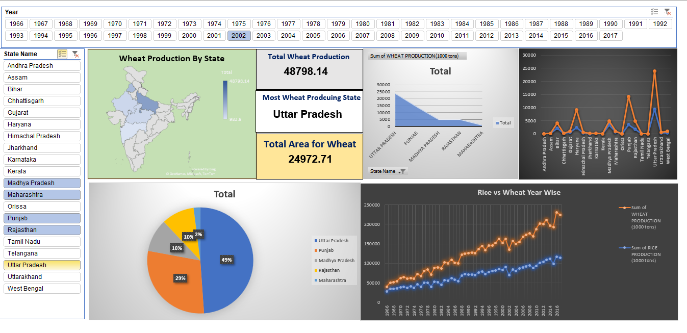

# 🌾 Indian State-Wise & Crop-Wise Agricultural Analysis Dashboard

## 📌 Project Overview

This project is an interactive Microsoft Excel dashboard developed to analyze agricultural production trends across Indian states. The dashboard provides dynamic insights into crop production using Pivot Tables, Pivot Charts, Slicers, and KPI Cards, enabling users to explore historical agricultural data efficiently.

---

## 📸 Dashboard Preview

### Dashboard 1

### Dashboard 2

---

## 🎯 Objectives

- Analyze agricultural production across Indian states.
- Compare crop production over multiple years.
- Identify the top-producing states for different crops.
- Visualize long-term production trends.
- Build an interactive dashboard for data-driven decision making.

---

## ✨ Features

- 📅 Interactive Year Slicer
- 📊 Top 10 Rice Producing States
- 🌱 Top 10 Oilseed Producing States
- 📈 Year-wise Production Trends for:
  - Rice
  - Wheat
  - Sorghum
- 📌 KPI Cards
  - Total States Covered
  - Total Districts Covered
- Dynamic Pivot Charts
- Interactive Dashboard Filters

---

## 🛠️ Tools & Technologies

- Microsoft Excel
- Pivot Tables
- Pivot Charts
- Slicers
- Conditional Formatting
- Data Visualization

---

## 📂 Dataset

The dataset used in this project is sourced from the **International Crops Research Institute for the Semi-Arid Tropics (ICRISAT)**. It contains historical agricultural production statistics across Indian states and districts for multiple crops over several years.

> **Data Source:** ICRISAT

---

## 🙏 Acknowledgements

This dashboard was developed as a data visualization and analytics project using publicly available agricultural datasets provided by **ICRISAT (International Crops Research Institute for the Semi-Arid Tropics)**.

---

## 📜 License

This project is intended for educational and portfolio purposes.
